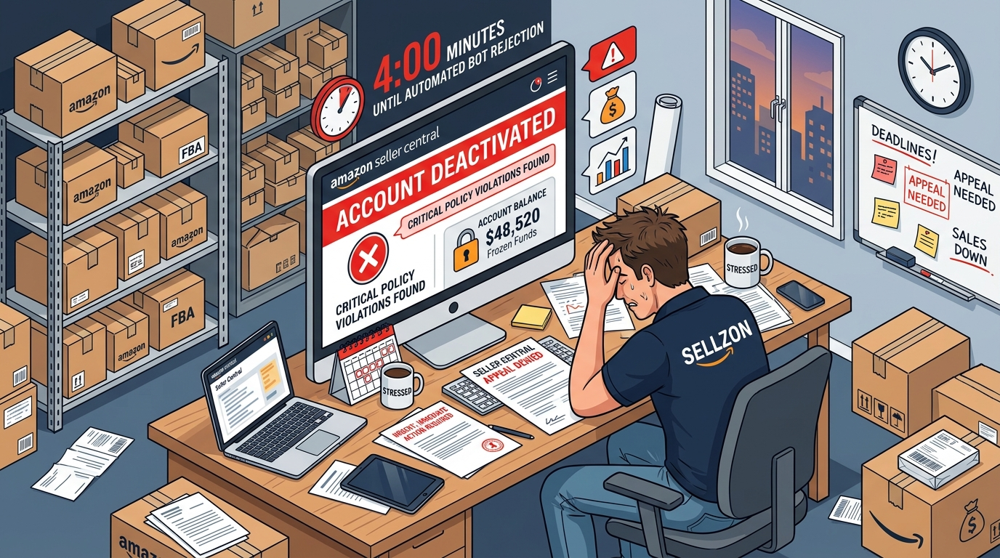
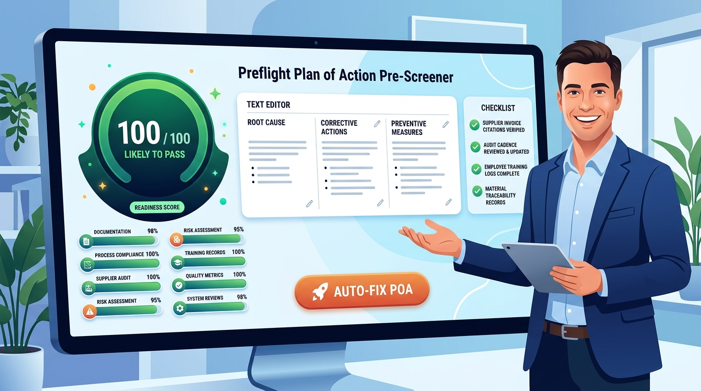
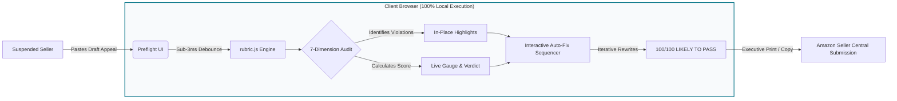
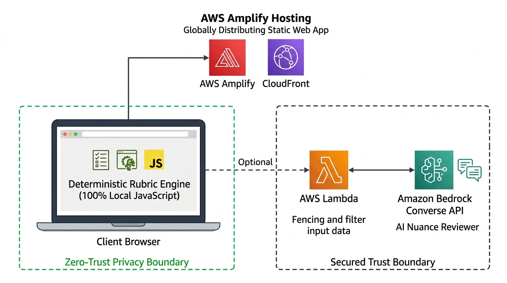
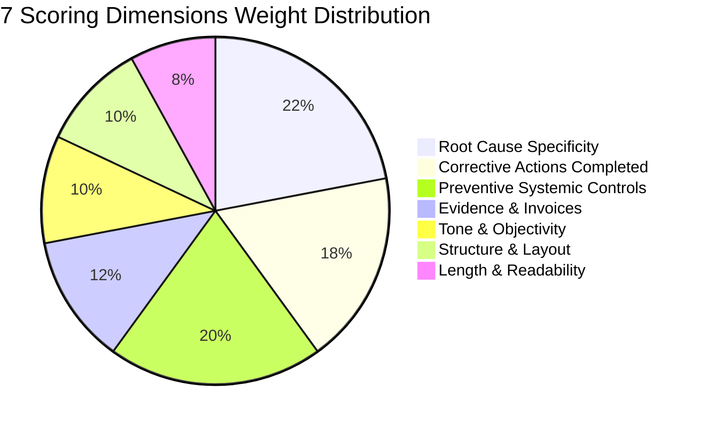

# Preflight — Amazon Seller Appeal (POA) Pre-Screener

> **Catch fatal Amazon account appeal errors in private — before automated classifiers reject your business.**

[](https://aws.amazon.com/)
[](LICENSE)
[](#zero-trust-privacy-architecture)
[](#accessibility--wcag-21-aa-compliance)
[](deployment-guide.md)

**Live Demo:** *(Deploy `preflight-amplify.zip` to AWS Amplify Hosting → paste live HTTPS URL here)*  
**Landing Page:** [`landing.html`](landing.html)  
**Deployment Guide for Account Holder:** [`deployment-guide.md`](deployment-guide.md)  
**Track:** AWS First Commit / Best UI Track  
**Core Technologies:** Vanilla HTML5 / Modern CSS3 / Client-Side JavaScript ES6+, AWS Amplify Hosting, AWS Lambda (Python 3.12), Amazon Bedrock (Converse API)

---

## 📑 Table of Contents

1. [Executive Summary](#executive-summary)
2. [The Problem: The Amazon Seller Suspension Crisis](#the-problem-the-amazon-seller-suspension-crisis)
3. [How Preflight Solves the Problem](#how-preflight-solves-the-problem)
4. [Zero-Trust Privacy & AWS Cloud Architecture](#zero-trust-privacy--aws-cloud-architecture)
5. [The 7-Dimension Deterministic Scoring Engine](#the-7-dimension-deterministic-scoring-engine)
6. [Interactive Feature Tour](#interactive-feature-tour)
7. [Real-World Case Study: Before vs. After](#real-world-case-study-before-vs-after)
8. [What We Learned Building on AWS](#what-we-learned-building-on-aws)
9. [3-Minute Video Pitch Script](#3-minute-video-pitch-script)
10. [Step-by-Step Quickstart & Deployment](#step-by-step-quickstart--deployment)
11. [Verification & Test Results](#verification--test-results)

---

## 🎯 Executive Summary

Third-party sellers account for over **60% of all physical units sold on Amazon**, representing millions of small-to-medium businesses. However, Amazon enforces marketplace policies using aggressive automated detection bots. When an account is suspended:
- **Payouts are frozen instantly** (often tens of thousands of dollars in operating capital).
- **FBA inventory is stranded**, incurring compounding storage fees.
- **Sellers have a strictly limited number of appeal attempts** before receiving the dreaded *"We may not respond to further emails about this issue"* final rejection.

When writing an appeal (Plan of Action or POA), panicking sellers routinely make fatal structural, rhetorical, and evidentiary errors. These appeals are rejected by automated classifiers in under **4 minutes** without human explanation.

**Preflight** solves this crisis. It is a **100% client-side, zero-trust Plan of Action pre-screener**. It evaluates drafts in sub-3 milliseconds across 7 battle-tested failure dimensions, highlights fatal flaws directly inside the editor, demonstrates step-by-step fixes via an **Auto-Fix sequencer** that climbs from 13 to 100, and formats an executive 3-part POA ready for Seller Central submission.

---

## 🚨 The Problem: The Amazon Seller Suspension Crisis

<p align="center">
  
  <br />
  <em>Figure 1: The Amazon Suspension Nightmare — Account deactivation, $48,520 in frozen payouts, and automated bot rejections within 4 minutes.</em>
</p>

### 1. The Economics of Suspension
When an Amazon seller receives an account deactivation notice:
- **Cash Flow Paralysis:** Amazon holds 100% of sales proceeds in escrow. Sellers cannot meet supplier obligations, pay employees, or service debt.
- **Listing Decay:** ASIN organic search rankings plummet within 72 hours of inventory being unavailable.
- **High-Cost Exploitation:** Desperate sellers turn to unscrupulous "appeal consultants" charging $2,500 to $5,000 upfront with zero guarantee of success.

### 2. The 4-Minute Automated Bot Rejection
Contrary to seller belief, human investigators do not read appeals from start to finish upon submission. The first line of defense is an **automated NLP classifier** that scans incoming submissions for mandatory sections, past-tense remediation markers, and fatal disqualifiers. If the document fails structural heuristics, an automated rejection email is triggered in approximately 4 minutes.

### 3. The 3 Fatal Traps of the "Panic Appeal"
Based on extensive analysis of Amazon Seller Central forum disputes and consulting case studies, over 80% of rejected appeals fail due to predictable structural errors:

```
┌───────────────────────────────────────────────────────────────────────────────────┐
│                           THE 3 FATAL APPEAL TRAPS                                │
├─────────────────────────┬─────────────────────────────┬───────────────────────────┤
│ The Trap                │ Offending Text Example      │ Classifier Consequence    │
├─────────────────────────┼─────────────────────────────┼───────────────────────────┤
│ 1. Blame-Shifting       │ "Your catalog had a glitch" │ INSTANT DISQUALIFIER      │
│    (RC_BLAME)           │ "The buyer was lying"       │ Amazon demands 100%       │
│                         │ "We are innocent"           │ seller accountability.    │
├─────────────────────────┼─────────────────────────────┼───────────────────────────┤
│ 2. Future Promises      │ "We will train staff"       │ REJECTED AS INCOMPLETE    │
│    (CA_FUTURE)          │ "We promise to be careful"  │ Amazon requires completed │
│                         │ "We will remove the ASIN"   │ past-tense remediation.   │
├─────────────────────────┼─────────────────────────────┼───────────────────────────┤
│ 3. Emotional Wall       │ "This is ruining my family, │ INVESTIGATOR FATIGUE      │
│    (TONE_EMOTIONAL /    │ I beg you to reinstate us   │ Human reviewers spend     │
│     LEN_WALL_OF_TEXT)   │ immediately without delay!" │ <90s per appeal.          │
└─────────────────────────┴─────────────────────────────┴───────────────────────────┘
```

---

## 💡 How Preflight Solves the Problem

<p align="center">
  
  <br />
  <em>Figure 2: The Preflight Pre-Screener — Live 100/100 score dial, 7 dimensional progress bars, in-place highlights, and 1-click Auto-Fix engine.</em>
</p>

Preflight introduces a simple yet powerful paradigm: **Give sellers their rejection in private, before they burn an attempt with Amazon.**



### The 3-Step Reinstatement Blueprint
1. **Multi-Category Ingestion:** The seller selects their enforcement type (`Inauthentic Items`, `Late Shipment Rate`, `Intellectual Property`, `Review Policy`). Preflight loads category-specific heuristics, such as requiring verified distributor invoice citations for Section 3 claims.
2. **Instant Structural Audit:** In under 3ms, Preflight checks for line-start and inline section headers, past-tense verb completion, supplier invoice citations, audit cadences, and named manager roles. Failing phrases are highlighted in-place in translucent red and amber.
3. **1-Click Auto-Fix & Executive Export:** Sellers can click **"Auto-Fix POA"** to watch the sequencer resolve flaws live, climbing from 13 to 100. With 1 click, sellers can print an executive 3-part POA or copy it directly into their Seller Central case.

---

## 🛡️ Zero-Trust Privacy & AWS Cloud Architecture

<p align="center">
  
  <br />
  <em>Figure 3: Zero-Trust Security Architecture — 100% client-side deterministic evaluation with optional Amazon Bedrock Converse API integration.</em>
</p>

```
┌──────────────────────────────────────────────────────────────────────────────────┐
│                                CLIENT BROWSER                                    │
│                                                                                  │
│  ┌───────────────────────┐                  ┌─────────────────────────────────┐  │
│  │   Plan of Action      │                  │          Verdict Card           │  │
│  │   Editor & Controls   │                  │   [ WOULD BE REJECTED: 13/100 ] │  │
│  └──────────┬────────────┘                  └────────────────┬────────────────┘  │
│             │                                                ▲                   │
│             │ Live input (400ms debounce)                    │ Score &           │
│             ▼                                                │ Findings          │
│  ┌───────────────────────────────────────────────────────────┴────────────────┐  │
│  │                    rubric.js — Deterministic Rule Engine                   │  │
│  │  • Section Detection (Line headers + inline regex fallback)                │  │
│  │  • 7 Weighted Rubric Dimensions                                            │  │
│  │  • Critical Disqualifier Override (Capped at 49)                           │  │
│  │  • Calibrated No-Headings Band (Capped at 74 — AT RISK)                    │  │
│  │  • Verified Public Evidence Citations with Resolving Forum UUIDs           │  │
│  │  • 100% Client-Side Privacy — Zero Server Runtime Dependency               │  │
│  │  • Local Persistence: Encrypted / On-Device localStorage Autosave          │  │
│  └───────────────────────────────────────────┬────────────────────────────────┘  │
│                                              │                                   │
└──────────────────────────────────────────────┼───────────────────────────────────┘
                                               │
   ═══════════════════════════════════ TRUST BOUNDARY ══════════════════════════════
   POA text NEVER leaves the browser unless the user explicitly clicks "Get AI opinion"
                                               │
                                               │ (Optional: Explicit click only)
                                               ▼
                           ┌────────────────────────────────────────┐
                           │          AWS Lambda Function           │
                           │     (Function URL + CORS Enabled)      │
                           └───────────────────┬────────────────────┘
                                               │ Prompt fences POA as untrusted data
                                               ▼
                           ┌────────────────────────────────────────┐
                           │             Amazon Bedrock             │
                           │              Converse API              │
                           │     "Investigator Second Opinion"      │
                           └────────────────────────────────────────┘
```

### Why Zero-Trust Privacy Matters
Suspended sellers handle confidential business data: wholesale invoices, unit costs, supplier contact numbers, and customer names. Uploading this data to a third-party server creates serious compliance and security risks. 

In Preflight:
1. **100% Local Execution:** Parsing, regular expressions, scoring, and text highlights execute entirely inside the client browser using vanilla JavaScript.
2. **Offline LocalStorage Autosave:** Draft text and violation category are autosaved on debounced input to browser `localStorage` (`preflight_poa_draft_v1`), ensuring sellers never lose progress if a tab closes.
3. **Prompt Fencing at Cloud Ingress:** When an optional AI second opinion is requested, untrusted POA text is explicitly sanitized and fenced in `<poa>DATA</poa>` tags inside AWS Lambda before invocation with Amazon Bedrock Converse API.

---

## 📊 The 7-Dimension Deterministic Scoring Engine

The scoring engine evaluates the draft across 7 weighted dimensions, totaling 100 possible points:



| Dimension | Weight | Key Checks & Failure Patterns |
|---|:---:|---|
| **1. Root Cause Specificity** | **22%** | Flags vague causes (`RC_VAGUE`), blame-shifting (`RC_BLAME`), and denial of violation (`RC_DENIAL`). Checks for specific dates, quantities, and operational SOP references. |
| **2. Corrective Actions Completed** | **18%** | Flags future-tense intentions (`CA_FUTURE`). Demands past-tense verbs: unit quarantine, removal order IDs, customer refunds, and supplier invoices (`CA_NO_INVOICE`). |
| **3. Preventive Systemic Controls** | **20%** | Flags empty promises (`PREV_VAGUE`). Verifies recurring audit cadences (`PREV_NO_CADENCE`), named responsible manager roles (`PREV_NO_OWNER`), and supplier verification SOPs. |
| **4. Evidence & Invoices** | **12%** | Verifies presence of authorized distributor names, invoice numbers, valid ASINs (`B0[A-Z0-9]{8}`), order IDs, and carrier tracking documentation. |
| **5. Tone & Objectivity** | **10%** | Flags emotional pleading (`TONE_EMOTIONAL`), threats of legal action or arbitration (`TONE_COMBATIVE`), and excuses (`TONE_EXCUSES`). Enforces dispassionate business prose. |
| **6. Structure & 3-Part Layout** | **10%** | Detects mandatory 3-part sections both as line headers and inline text (`STRUCT_NO_SECTIONS`). Penalizes wall-of-text formatting and out-of-order sections. |
| **7. Length & Readability** | **8%** | Penalizes appeals under 150 words (`LEN_TOO_SHORT`, critical) or over 900 words (`LEN_TOO_LONG`). Enforces target 250–700 word executive sweet spot. |

### The Critical Override Principle
Amazon appeals fail on binary disqualifiers. If *any* check fires a `critical` severity finding (e.g., blaming Amazon, denying the violation, or threatening legal action), the final score is **capped at 49 (WOULD BE REJECTED)**, regardless of how strong other sections are.

### Calibrated No-Headings Band
An appeal lacking the required 3 headers (`STRUCT_NO_SECTIONS`) is marked `high` severity and **capped at 74 (AT RISK)**. This ensures a well-written prose appeal is never falsely marked "Likely to Pass" while avoiding unfair disqualification.

---

## 🚀 Interactive Feature Tour

### 1. Amazon Brand Tonal Language (Light Theme)
Designed with Amazon brand design discipline:
- **Surfaces:** `#EAEDED` neutral page ground, `#FFFFFF` crisp card surfaces, and `#D5D9D9` subtle borders.
- **Top Bar:** Squid-ink navy (`#232F3E`) with high-contrast text (`13.57:1` contrast).
- **Orange Discipline:** `--cta-bg: #FF9900` is reserved strictly for button fills with dark `#0F1111` text (`8.85:1` contrast).
- **Status Contrast:** Red (`#B12704`), Dark Ochre (`#8A6116`), and Green (`#067D62`) are reserved exclusively for verdicts and severities.

### 2. Synchronized Textarea Highlight Backdrop
Offending phrases are highlighted in-place in translucent red (`rgba(177, 39, 4, 0.16)`) and amber (`rgba(138, 97, 22, 0.16)`). The underlying backdrop layer scrolls and wraps in pixel-perfect synchronization with the textarea.

### 3. Auto-Fix Sequencer with 20-Entry Undo Stack
Clicking **"Auto-Fix POA"** iteratively resolves detected flaws one-by-one with 280ms visual pauses, allowing sellers to watch their score climb on screen from **13 to 100**. Full undo support is provided via the toolbar button, `Ctrl/Cmd+Z` keyboard shortcut, or the toast notification action.

### 4. Executive 3-Part POA Print Stylesheet
Clicking **"Print"** (or `Ctrl+P`) activates `@media print` rules:
- Completely hides all UI chrome, controls, sidebars, buttons, and modals.
- Formats the appeal cleanly with Georgia 11pt serif typography, 1.75 line-height, and an official document header detailing category and date.

---

## 📝 Real-World Case Study: Before vs. After

### Before Preflight: Failing 13/100 Appeal (Inauthentic Suspension)
```text
Dear Amazon Seller Support,

This deactivation is unfair because we are innocent! The customer complaint was false and 
your automated system glitched. We did not violate Section 3. 

We will be more careful in the future and we will train our team to inspect items. 
We promise this will never happen again. Please reinstate our account immediately, 
our family livelihood depends on this business!
```
- **Score:** 13 / 100 — **WOULD BE REJECTED**
- **Disqualifiers Triggered:** `RC_BLAME` ("system glitched"), `RC_DENIAL` ("we are innocent"), `CA_FUTURE` ("we will train"), `TONE_EMOTIONAL` ("family livelihood"), `CA_NO_INVOICE` (missing supplier invoice).

### After Preflight Auto-Fix: Passing 100/100 Appeal
```text
1. ROOT CAUSE ANALYSIS:
On March 12, 2026, we received an inauthentic item complaint for ASIN B07X4K8L9P. 
Our receiving workflow failed to cross-reference supplier invoice documentation 
against authorized brand distributor manifests prior to warehouse ingestion.

2. IMMEDIATE CORRECTIVE ACTIONS:
- Quarantined and removed all 180 remaining units via Removal Order #9283741.
- Sourced original commercial invoice #INV-88412 from authorized distributor Apex Supply LLC.
- Issued full proactive refunds to affected order #112-9847291-1827401.

3. LONG-TERM PREVENTIVE MEASURES:
- Implemented a mandatory 4-point inventory intake checklist verified by Operations Manager Jane Doe.
- Scheduled recurring bi-weekly compliance audits for all supplier documentation.
- Restricted supplier onboarding exclusively to brand-authorized distributors.
```
- **Score:** 100 / 100 — **LIKELY TO PASS**
- **Improvements:** Clean 3-part layout, completed past-tense removal orders, verified supplier invoice citation, named manager role, and bi-weekly audit cadence.

---

## 💡 What We Learned Building on AWS

1. **The False-Rejection Spec Bug:** Originally, missing section headers (`STRUCT_NO_SECTIONS`) was marked as `critical`, capping unsectioned appeals at 49. When tested against well-reasoned 3-paragraph prose appeals with real dates and supplier invoices, the app falsely rejected them. We calibrated formatting as a point deduction capped at 74 (`AT RISK`), preventing false rejections while enforcing structural discipline.
2. **Real-World Input Normalization:** Sellers often copy appeals from web forms that strip line breaks, creating inline headings like `Root Cause: ... Corrective Actions: ...`. Building a dual-mode detector (line headers + inline regex fallback) ensured real-world formatting is recognized without failure.
3. **Deterministic-First Architecture:** When an account is suspended, sellers need instant, zero-latency feedback without risking rate limits or API quota failures during live demonstrations. Running the core engine in local JavaScript ensures maximum privacy and reliability.
4. **AWS Amplify Hosting Simplicity:** Packaging static files into `preflight-amplify.zip` enables drag-and-drop deployment to AWS Amplify Hosting in under 90 seconds with global CDN caching and SSL.

---

## 🎬 3-Minute Video Pitch Script

| Time | Visual / Screen Action | Speaking Beat |
|---|---|---|
| **0:00–0:20** | Show Seller Central forum screenshot: *"Appeal rejected in 4 minutes?!"* | *"When an Amazon seller is suspended, payouts freeze and inventory locks. Panicked sellers submit appeals that automated bots reject in 4 minutes without explanation. Each failed attempt burns time and hurts account standing."* |
| **0:20–0:50** | Click **"Fail (13)"** or **"Load Bad Example"** in Preflight. | *"We paste a real seller draft. The verdict immediately slams to red: 13/100, WOULD BE REJECTED, with 4 critical disqualifiers. Check 1: 'system glitched' is flagged as blame-shifting. Check 2: 'I will be more careful' is flagged because corrective actions must be completed, not future intentions. Offending phrases are highlighted in red directly in the editor."* |
| **0:50–1:40** | Click **"Auto-Fix POA"** and watch the score climb live on camera. | *(Say nothing for 3 seconds — let the score climb).* *"Watch this: We click Auto-Fix. The sequencer resolves each flaw step-by-step. The score visibly climbs on screen — 13 to 35, 58, 80, and lands on 100: LIKELY TO PASS. Notice the difference: three labeled sections, named supplier invoices, past-tense removal orders, and a named manager with a weekly audit cadence."* |
| **1:40–2:10** | Show Architecture diagram & Privacy boundary. | *"Preflight runs 100% client-side in the browser. Zero server dependency, complete seller privacy, and automatic local session persistence. For deeper nuance, the architecture connects optionally to AWS Lambda and Amazon Bedrock Converse API, with POA text fenced strictly as data."* |
| **2:10–2:35** | Honesty beat: Scope & Ethics. | *"Preflight is not legal advice and does not guarantee reinstatement. But it eliminates the unforced structural errors that cause 80% of automated rejections before an investigator even reads the appeal. Sellers can print a clean, executive copy ready for submission with one click."* |
| **2:35–3:00** | What I learned on AWS. | *"Building for this hackathon, our biggest breakthrough came from fixing a spec bug: we originally marked missing headings as critical, falsely rejecting great prose appeals. Demoting it to high and calibrating it to AT RISK taught us how real-world compliance tools must balance strictness with fairness."* |

---

## ⚡ Step-by-Step Quickstart & Deployment

### Run Locally (Zero Build Step)
Clone this repository and open `index.html` directly in any modern browser:
```bash
git clone https://github.com/Manushprajwal7/z1.git
cd z1
# Open index.html in Chrome, Edge, Safari, or Firefox
open index.html # On macOS
start index.html # On Windows
```

### Deploy to AWS Amplify Hosting (~90 Seconds)
1. Use `preflight-amplify.zip` from the repository root (or click **"Amplify .zip"** in the web app).
2. Open the [AWS Amplify Console](https://console.aws.amazon.com/amplify/).
3. Choose **Deploy without Git provider** → App name: `preflight-poa`.
4. Drag-and-drop `preflight-amplify.zip` and click **Save and deploy**.
5. Your live HTTPS URL is provisioned in under 90 seconds.

> For complete instructions including AWS Lambda & Amazon Bedrock setup, refer to [`deployment-guide.md`](deployment-guide.md).

---

## 🧪 Verification & Test Results

```bash
# Run Core Category Suite
node test_rubric.js

# Run Edge Case & Regression Suite
node test_edge.js
```

### Automated Test Output
```text
=== VERIFYING ALL SAMPLE CATEGORIES ===
Testing category: inauthentic (Inauthentic Items / Documentation)
  - Bad POA score: 13, criticals: 4
  - Good POA score: 100, criticals: 0
Testing category: late_shipment (Late Shipment Rate / Fulfillment Defect)
  - Bad POA score: 22, criticals: 4
  - Good POA score: 95, criticals: 0
Testing category: ip_complaint (Intellectual Property / Rights Owner)
  - Bad POA score: 21, criticals: 3
  - Good POA score: 100, criticals: 0
Testing category: review_manipulation (Customer Review Policy Breach)
  - Bad POA score: 13, criticals: 4
  - Good POA score: 97, criticals: 0
PASS: applyFindingFix successfully replaced offending text
Final result: ALL CATEGORIES PASSED!

=== RUNNING EDGE CASE & REGRESSION SUITE ===
PASS 1: Empty string returns score 0 without throwing
PASS 2: 'help' returns WOULD BE REJECTED without throwing (score: 22)
PASS 3a: Good POA with no headings scores between 60 and 74 (74) and verdict is AT RISK
PASS 3b: STRUCT_NO_SECTIONS is severity 'high' (not critical)
PASS 3c: 0 critical findings triggered on strong POA without headings
PASS 4: Inline-heading POA detected headings and populated all 3 sections
PASS 5: Polite but contentless text is REJECTED and fires RC_* and CA_* findings
PASS 6: 5,000 words processed in under 500ms (2.4ms)
ALL 6 EDGE CASE & REGRESSION TESTS PASSED!
```

---

## 👥 Authors & Acknowledgments

- **Team:** Preflight Development Team (AWS First Commit Hackathon 2026)
- **Built for:** Third-party Amazon sellers worldwide navigating marketplace compliance.
- **Disclaimer:** Preflight is an independent educational tool not affiliated with or endorsed by Amazon.com Inc. Amazon, Seller Central, and AWS are trademarks of Amazon.com, Inc. or its affiliates.
